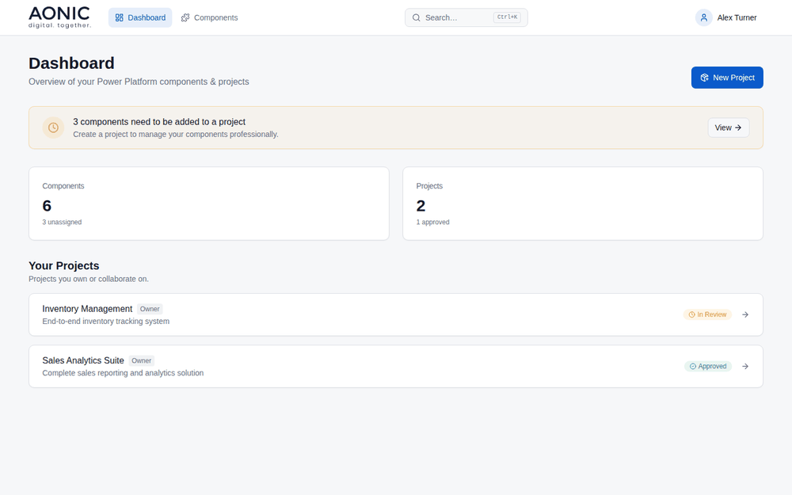

# Agent Governance 365

**Shadow AI and Shadow IT have a price tag. Agent Governance 365 is the organisational governance layer for your Microsoft 365 tenant — it inventories every Copilot Studio agent, Power Platform, and Power BI asset, allowing citizen developers to register them under a project with an owner, collaborators, a business unit, and a governance or compliance questionnaire.**

[](LICENSE)
[](package.json)
[](#contributing)

In practice, that means every Power Platform, Power BI, and Copilot Studio
asset in your tenant is accounted for, with a registered owner and
collaborators your team can reach directly. That registration data —
ownership, business unit, governance and compliance answers — is available
through the API, so your team can build custom automation on top of it:
alerting when an asset hits a cost or capacity threshold, defining next
steps for that scenario, or flagging assets left without an active owner.

It runs entirely in your own Azure subscription — sign-in through your own
**Microsoft Entra ID** tenant, storage in your own **PostgreSQL** database.
Nothing about your tenant's agents, apps, or reports passes through a
third party.



---

## Table of contents

- [Why Agent Governance 365](#why-agent-governance-365)
- [How it's different](#how-its-different)
- [What it does](#what-it-does)
- [Architecture](#architecture)
- [Quick start](#quick-start)
- [Full deployment guide](#full-deployment-guide)
- [Tech stack](#tech-stack)
- [Roadmap](#roadmap)
- [Contributing](#contributing)
- [Enterprise Support](#enterprise-support)
- [License](#license)

---

## Why Agent Governance 365

As Copilot Studio, Teams, SharePoint, and Power BI all make it easier for
anyone in an organization to publish an agent, a flow, or a report, the
governance question stops being "can we build this" and becomes "do we know
this exists." That gap shows up as a few concrete, recurring problems:

- **Shadow AI and agent sprawl** — agents get published across Teams, Copilot
  Studio, and SharePoint faster than any inventory can keep up, with
  ownership tracked, if at all, in a spreadsheet.
- **Fragmented governance** — Power Platform, Power BI, and Copilot each have
  their own admin center, their own permission model, and no shared view.
- **Security and compliance blind spots** — over-permissioned agents,
  unclear data access, and Power BI content without a sensitivity label are
  hard to catch across several separate tools.
- **No Copilot cost visibility** — Copilot Credits and Power BI capacity
  consumption aren't tracked next to who owns what and why.

Agent Governance 365 closes that gap by bringing ownership, governance, and
cost together in one self-hosted place.

## How it's different

Most Copilot and Power Platform governance tools are either a DIY starter
kit you have to assemble yourself, or a vendor-hosted SaaS platform that
asks for its own consent grant into your tenant and a per-seat or per-agent
subscription. Agent Governance 365 takes a different approach:

- **Self-hosted, not vendor-hosted** — your inventory, ownership, and
  Copilot cost data stay in infrastructure you control, not a vendor's
  cloud. Data residency follows your own Azure region — nothing about it
  is decided by a third party.
- **Open source, not a black box** — MIT-licensed, so your security or
  platform team can read, audit, and extend every line that touches your
  tenant data instead of trusting an opaque third-party connector.
- **No per-seat or per-agent licensing** — there's no subscription; the only
  ongoing cost is the Azure infrastructure you're already running.
- **Built on your existing trust boundary** — it reads Power Platform, Power
  BI, and Copilot Agent Kit data through Microsoft's own APIs, rather than
  requiring a new external consent grant.
- **One inventory across sources, not five admin centers** — Power Platform,
  Power BI/Fabric, and Copilot Agent Kit usage land in a single, searchable,
  permission-aware view instead of separate exports you reconcile by hand.

## What it does

Agent Governance 365 syncs, on a schedule you control, from the Microsoft
APIs your tenant already has:

- **Power Platform inventory** — environments, apps, flows, and their owners
- **Power BI / Fabric inventory** — workspaces, reports, dashboards, and
  sensitivity labels, via the Power BI Admin / Scanner API
- **Copilot Agent Kit usage** — daily Copilot credit consumption, via
  Dataverse

...and gives your team a single, searchable, permission-aware view of all of
it.

Every inventory source is optional and independent — run Agent Governance
365 with none of them connected (core project/component tracking still
works) and add each one whenever you have the admin rights for it.

## Architecture

```
Browser (Static Web App or Vite)
    │  Entra ID (MSAL) login
    ▼
Express API (App Service or local :7071)
    ├── PostgreSQL (projects, components, inventory, jobs, …)
    ├── Power Platform Inventory API (delegated refresh token)  → inventory_sync
    ├── Power BI Admin / Scanner API (service principal)         → powerbi_inventory_sync
    └── Copilot Agent Kit Dataverse (optional app-only SP)       → copilot_kit_usage_sync
```

```
agent-governance-365/
├── frontend/          # React + Vite + MSAL
├── backend/           # Express + jobs + schema.sql
├── infra/             # Azure Terraform generator (`npm run setup:azure`)
├── e2e/               # Playwright browser tests
└── .github/workflows/ # CI / deploy (customize for your org)
```

Jobs can be started from the Admin UI or via a secret-gated internal endpoint
used by a nightly timer (Logic App / Azure Function). See
[`DEPLOYMENT.md`](DEPLOYMENT.md) for the full jobs reference.

## Quick start

Try it locally with no Microsoft Entra tenant and no Azure resources, using
the in-memory store:

```sh
git clone https://github.com/AONIC-GmbH/agent-governance-365.git
cd agent-governance-365
npm install

# frontend/.env.development
echo "VITE_MOCK_MODE=true" >> frontend/.env.development
echo "VITE_API_BASE_URL=http://localhost:7071" >> frontend/.env.development

npm run dev:all
```

Frontend on the Vite port (commonly `http://localhost:8080`), API health
check at `http://localhost:7071/health`.

With mock mode off and no Entra client ID, the UI uses a seeded local user
and talks to the live API (memory store if `DATABASE_URL` is unset).

## Full deployment guide

Local mock mode is the five-minute version. For a real deployment — your own
Microsoft Entra app registrations, Azure infrastructure via Terraform,
PostgreSQL, and connecting Power Platform / Power BI / Copilot Agent Kit
sync — see [`DEPLOYMENT.md`](DEPLOYMENT.md).

## Tech stack

React, Vite, and MSAL on the frontend; Node.js and Express on the backend;
PostgreSQL for storage; Microsoft Entra ID for authentication; Terraform for
Azure infrastructure (App Service, Static Web Apps, Postgres Flexible
Server, Key Vault); GitHub Actions for CI/CD.

## Roadmap

- [ ] Inventory for agents published outside Copilot Studio / Power Platform
      — e.g. Teams and SharePoint agents
- [ ] Richer risk/compliance flags (over-permissioned agents, missing
      sensitivity labels)
- [ ] Cost trend views for Copilot Credits and Power BI capacity

## Contributing

Issues and pull requests are welcome. Please open an issue to discuss any
significant change before submitting a PR.

Public OSS repos should keep **CI (lint/test)** in-tree; keep **org-specific
Azure deploy workflows** (resource names, publish profiles) in a **private**
fork or separate private repo so secrets and hostnames are not published.

## Enterprise Support

Self-hosting a pilot is one thing. Rolling this out across every business
unit, wiring the Entra app registrations and Azure infrastructure for
production, or building the cost-alerting and automation workflows the API
enables — that's where most teams want an experienced hand.

[AONIC](https://aonic.de/en) built and maintains Agent Governance
365, and offers enterprise support for deployment, customization, and
broader Microsoft 365 and Copilot governance strategy.

**[AONIC – AI-First Beratung für Ihre Digital Transformation →](https://aonic.de/en/contact)**

## License

[MIT](LICENSE) © AONIC GmbH
